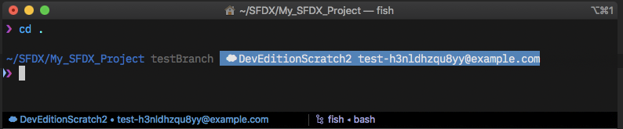

# Salesforce DX (SFDX) Status for iTerm2
Adds the status of Salesforce DX projects to your iTerm2 status bar.

## Requirements

- [iTerm2](https://github.com/gnachman/iTerm2)

## Installation

1. Go to *iTerm2 > Preferences > General > Magic* and check "Enable Python API"
2. Copy `SFDX.py` to `~/Library/Application Support/iTerm2/Scripts/AutoLaunch/`
3. Go to *Scripts > AutoLaunch* and check "SFDX.py" to allow the script as a Status Bar component
4. Go to *Preferences > Profiles > <yourProfile> > Session* and click "Configure Status Bar"
5. Drag & drop the component "SFDX Status" into the Active Components pane (you might need to scroll in the upper pane)
6. Select the component in the active pane, and click "Configure Component"
7. Make your respective configurations
8. `cd` into any directory with a `.force` project folder
9. Check your status bar

## Usage

- Simply open any directory that contains a `.force` folder and watch your status bar change
- If a cloud is displayed but nothing else, the current directory is not a SFDX project folder
- Click on the status bar component to display the org's expiration date

**Note** The fish prompt for SFDX can be found [here](https://github.com/mschmidtkorth/fish-pure-prompt-salesforce-dx).

## How to Contribute

Please see the [contribution guidelines](CONTRIBUTING.md).

## Changelog

- **0.1.0** (2020-02-19)
  - Initial release